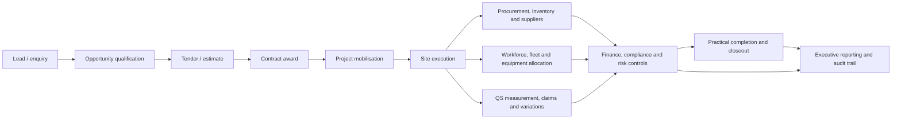
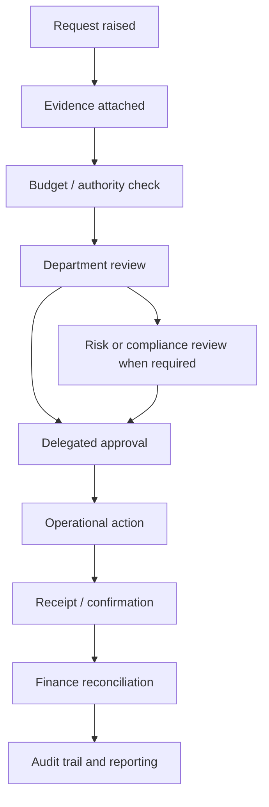
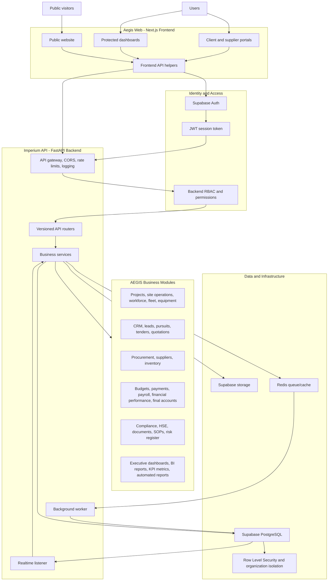
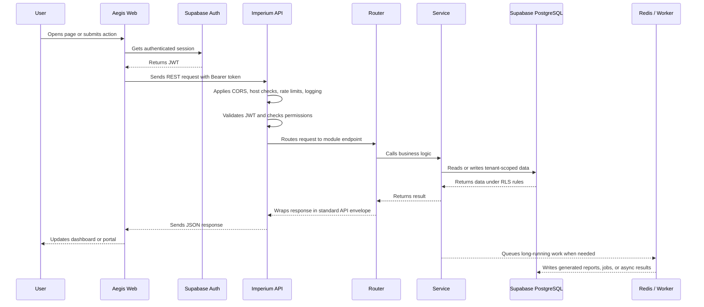
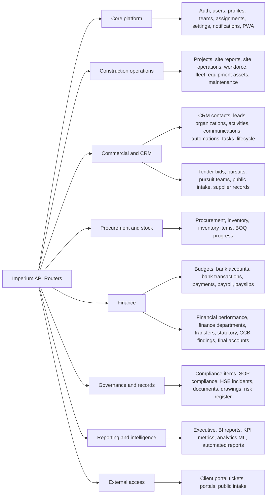

# AEGIS System and Business Organogram

This organogram combines two views of Project AEGIS:

1. The technical system structure visible from the codebase.
2. SNC's target operating model, which explains how the business should be organised, governed, and gradually institutionalised.

The system should not simply reproduce the current informal operating reality. It should help SNC move from MD-dependent decision-making toward delegated authority, clear departmental accountability, evidence-backed workflows, and independent risk oversight.

## SNC Target Operating Model

```mermaid
flowchart TD
    md[CEO / Managing Director]

    risk[Risk Department<br/>Independent oversight and upward reporting]
    control[Corporate Control Services]
    commercial[Commercial Department]
    construction[Construction Department]
    plant[Plant and Equipment Department]

    finance[Finance]
    hr[HR]
    legal[Legal and Compliance]
    ict[ICT]
    admin[Executive Administration]

    marketing[Marketing and business development]
    crm[CRM, leads and opportunities]
    tenders[Tenders and estimating]
    qs[Quantity surveying and contracts]
    client[Client relationships]

    mobilisation[Project mobilisation]
    site[Site execution]
    quality[Quality and programme control]
    hse[HSE]
    closeout[Project closeout]

    fleet[Fleet and machinery]
    operators[Operators]
    maintenance[Maintenance]
    fuel[Fuel]
    hire[Plant hire and utilisation]

    md --> control
    md --> commercial
    md --> construction
    md --> plant
    risk -. independent assurance .-> md
    risk -. oversight .-> control
    risk -. oversight .-> commercial
    risk -. oversight .-> construction
    risk -. oversight .-> plant

    control --> finance
    control --> hr
    control --> legal
    control --> ict
    control --> admin

    commercial --> marketing
    commercial --> crm
    commercial --> tenders
    commercial --> qs
    commercial --> client

    construction --> mobilisation
    construction --> site
    construction --> quality
    construction --> hse
    construction --> closeout

    plant --> fleet
    plant --> operators
    plant --> maintenance
    plant --> fuel
    plant --> hire
```

## Operating Reality vs Target vs System Enforcement

| Layer | Meaning | AEGIS role |
|---|---|---|
| Current reality | Existing staff, informal practices, MD dependency, and current approval habits. | Capture what is happening without hard-coding weak controls as permanent rules. |
| Target operating model | The departmental structure and delegated authority SNC is moving toward. | Represent departments, roles, responsibilities, workflows, and escalation paths. |
| System enforcement | Permissions, approval limits, evidence requirements, audit trails, and segregation of duties. | Force the target model to operate consistently and reduce dependency on individuals. |

## Governance Separations AEGIS Must Enforce

| Separation | Practical meaning |
|---|---|
| Requesting from approving | A person who asks for expenditure, stock, labour, plant, or a contract action should not be the final approver of the same action. |
| Purchasing from receiving | Procurement raises orders; site/store/receiving confirms goods or services actually arrived. |
| Recording from reconciling | Data capture and finance reconciliation should be different responsibilities. |
| Site execution from commercial measurement | Site teams record progress and events; commercial/QS functions measure value, claims, variations, and contractual impact. |
| Asset use from maintenance authorisation | Plant users request and record usage; maintenance/fleet control authorises repair, service, and release decisions. |
| Operational management from risk oversight | Operating departments run the work; Risk independently reviews exceptions, controls, compliance, and exposure. |

## Business Lifecycle Architecture

## Department-to-System Mapping

| SNC function | Primary AEGIS modules |
|---|---|
| CEO / Managing Director | Executive dashboards, approvals, BI reports, automated reports, audit logs. |
| Corporate Control Services | Finance, budgets, bank accounts, payments, payroll, HR records, users, teams, settings, legal/compliance records, ICT administration. |
| Commercial Department | CRM contacts, leads, activities, communications, tenders, pursuits, quotations, BOQ progress, contracts, client relationships. |
| Construction Department | Projects, site operations, site reports, workforce, quality, HSE incidents, documents, project closeout. |
| Plant and Equipment Department | Fleet, equipment assets, operators, maintenance schedules, fuel-related records, utilisation, plant deployment. |
| Risk Department | Risk register, compliance items, SOP compliance, HSE oversight, audit evidence, exception reporting, executive assurance. |

## Authority and Workflow Model

## High-Level System Structure

## Request Flow

## Backend Module Groups

## Runtime Components

| Component | Role |
|---|---|
| `aegis-web` | Next.js frontend for the public website, dashboards, and portals. |
| `imperium-api` | FastAPI backend that owns authorization, business logic, and database access. |
| `imperium-worker` | Background worker for queued or long-running tasks. |
| `redis` | Queue/cache used by the API and worker. |
| Supabase Auth | User authentication and JWT session issuing. |
| Supabase PostgreSQL | Main application database with tenant isolation through `organization_id` and RLS. |
| Supabase Storage | Document, report, quotation, and generated-file storage target. |

## Plain-English Summary

AEGIS works as a layered business platform. The frontend is the screen that users interact with. The Imperium API is the control layer that checks who the user is, what they are allowed to do, and which business module should handle the request. Business modules then read or write data in Supabase, while background workers handle slower jobs such as generated reports, documents, quotation outputs, or automation tasks.
