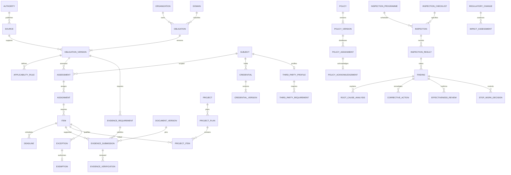

# Database specification and entity relationships

Proposed tables reside in existing `compliance` schema unless stated otherwise. This is a migration design, not applied DDL. Existing table definitions must be reconciled against the migration ledger before allocating migration numbers.

## Common contract

Every new row: UUID `id`, non-null `organization_id` referencing `core.organizations`, `created_at`/`created_by`, classification, and tenant-aware unique `(organization_id,id)`. Mutable aggregates additionally have `updated_at`, `updated_by`, positive integer `lock_version`, `is_deleted`, `deleted_at`, `deleted_by`, deletion reason. Require deletion metadata consistency. Approved versions, submissions, verifications, decisions and audit history are append-only; soft deletion does not hide them from authorised history or remove them from evidence evaluation.

All child relationships use `(organization_id,parent_id)` composite FKs to a corresponding unique parent key. Existing owner tables need these keys added safely before linking. Project-bound relationships also constrain project identity; use `(organization_id,project_id,parent_id)` where needed. Never accept a bare polymorphic UUID as an enforceable FK. Use RESTRICT for historical references and organisation deletion; no cascading deletion of proof. User deactivation preserves actor references.

Dates: DATE for jurisdictional local due dates; TIMESTAMPTZ for decisions and instants. Effective ranges are `[effective_from,effective_to)` with end greater than start; review date cannot precede effective start. Evidence expiry date includes the local calendar day and is converted using the recorded jurisdiction timezone. Approved overlapping versions for the same rule/subject scope are prohibited by exclusion constraint (GiST where supported) or a locked validation trigger. Never backdate the server-recorded approval instant.

Index each FK starting with tenant; mutable registries index `(organization_id,status,updated_at,id)`. Deadlines index `(organization_id,due_at,status)`, evidence `(organization_id,item_id,submitted_at)`, findings `(organization_id,project_id,severity,status)`. Partial active-row indexes supplement, never replace, historical uniqueness. Keyset pagination; bounded date windows for calendars/exports. Status CHECKs restrict values; guarded transition functions/services plus immutable-record triggers restrict changes between valid values.

## Entity catalogue

All names below include the common contract. `->` denotes tenant-aware FK. U denotes additional uniqueness; fields are required unless marked optional.

| Entity | Principal fields and relationships | Constraints / lifecycle |
|---|---|---|
| domains | code, name, owner -> users | U tenant/code; archive |
| authorities | code, name, jurisdiction, contact reference | U tenant/code; archive |
| sources | authority -> authorities optional, kind legal/contract/policy, citation, URI, document version reference optional, jurisdiction, verified_by/at | Source verification human; no invented validity |
| obligations | code, domain -> domains, owner -> users, current_version optional | U tenant/code; Draft initially |
| obligation_versions | obligation -> obligations, version_number, previous_version optional, source -> sources, text, jurisdiction, effective/review dates, criticality, approval reference | U tenant/obligation/version; approved immutable |
| applicability_rules | obligation_version, rule_version, subject kinds, bounded declarative expression, input schema, jurisdiction/source/effective/review metadata | No executable SQL/Python expressions; expression schema validated; immutable approved rules |
| subjects | kind, project_id/employee_id/supplier_id/subcontractor_id/consultant reference/fleet_id optional | Exactly one matching typed reference except organisation subject; organisation subject unique per tenant; consultant identity resolved through existing party owner before Phase 6 |
| applicability_assessments | obligation_version, rule_id, subject_id, project_id optional, input snapshot/hash, proposed outcome, reason, human decision, approval reference | Unknown/applicable/not_applicable; rejected N/A remains unresolved; version-bound approval |
| assignments | assessment_id, subject_id, accountable_user_id, responsible_user_id, project_id optional, effective range | No overlapping active accountable assignments per assessment |
| items | assignment_id, obligation_version, subject_id, project_id optional, status, assurance_level, evaluation_at, next_invalid_at | U assignment/requirement occurrence as appropriate; stores projection provenance |
| deadlines | item_id, recurrence version, occurrence key, due_at, timezone, warning schedule, status | U tenant/item/occurrence; recurrence changes preserve past instances |
| evidence_requirements | obligation_version, code, type, quantity, freshness interval, independent_confirmation_required, allowed issuer rules | U tenant/version/code; versioned acceptance criteria |
| evidence_submissions | item_id, requirement_id, submission_number, document version reference, digest, submitter, subject snapshot, validity interval, predecessor optional | U tenant/item/requirement/submission; immutable after submit; document access and tenant validated |
| evidence_verifications | submission_id, verifier_id, decision, reason, method, checked_at, issuer-confirmation reference optional, validity limit | Append-only; verifier != submitter and subject; one final decision per verification round |
| credentials | kind registration/licence/permit/certificate/insurance, subject_id, project_id optional, current_version optional | Single lifecycle aggregate for the five credential types; HSE work permits remain HSE-owned |
| credential_versions | credential_id, version_number, issuer_id, number, issued_on, expires_on, evidence_submission_id, status, replaced_version optional | U tenant/credential/version; replacement preserves old version; validity check |
| project_plan_templates | code, version, approved requirements snapshot | U tenant/code/version; versioned |
| project_plans | project_id, template_version, version_number, phase mobilisation/operation/closeout, approval reference | U tenant/project/phase/version |
| project_items | project_id, plan_id, item_id, mandatory, critical, weight | U tenant/plan/item; project consistent across links |
| third_party_profiles | subject_id, review_status, assessment_at, next_review_at | U tenant/subject; compliance status separate from commercial party status |
| third_party_requirements | profile_id, item_id, qualification/category, conditional terms optional | U tenant/profile/item; tax status references Finance evidence |
| inspection_programmes | scope, owner, recurrence version, checklist_version | Scheduled compliance inspections only |
| inspection_checklists | code, version, approved_at, criteria snapshot with stable item IDs | U tenant/code/version; approved immutable |
| inspections | programme_id optional, subject_id, project_id optional, inspector, scheduled_at, performed_at optional, status | Completion requires all mandatory results |
| inspection_results | inspection_id, checklist_item_id, outcome, evidence_submission_id optional, notes | U tenant/inspection/checklist item; failed critical result creates finding |
| findings | item_id optional, inspection_result_id optional, subject_id, project_id optional, severity, category, status, escalation_due_at | Critical escalation cannot be suppressed by owner; repeat key is signal, not automatic closure |
| root_cause_analyses | finding_id, version, author, analysis, approval reference | U tenant/finding/version; retain revisions |
| corrective_actions (existing) | add finding_id, accountable_user_id, plan_version, remediation evidence references, due_at and locking | Map existing free-text owners explicitly; never auto-close historical CAPA |
| effectiveness_reviews | finding_id, reviewer_id, evidence reference, criteria, observation window, result, reviewed_at | Reviewer independent of remediation; failure reopens |
| policies | code, owner, domain | U tenant/code; controlled document reference |
| policy_versions | policy_id, version, document version reference, effective/review dates, approval reference | U tenant/policy/version; immutable after approval |
| policy_assignments | policy_version, employee/user subject, deadline_id, training reference optional | U tenant/policy version/subject |
| policy_acknowledgements | assignment_id, actor_id, acknowledged_at, exact version digest, training evidence optional | U tenant/assignment; acknowledgement alone never proves training |
| regulatory_changes | source_id, jurisdiction, identified_at, status, owner | Human verified source and approvals |
| impact_assessments | change_id, version, affected obligation/project/department references, assessment, implementation plan, approval reference | U tenant/change/version; child scope links use typed FKs |
| exceptions | type operational/policy, subject_id, item_id, reason, authority reference, compensating controls, evidence reference, expiry, approval reference | Does not change evidence to verified or status to compliant |
| exemptions | exception_id, legal basis/source, review requirements, lifecycle status | U tenant/exception; all approval prerequisites required |
| stop_work_decisions | project_id, subject_id optional, finding_id, decision issue/release, predecessor optional, reason, approval/evidence references, issued_at | Append-only issue and release decisions; cannot overwrite issue |

Approval, notification and audit event are reused Core entities, not Compliance tables. Extend `core.approval_instances/steps/decisions` contracts where necessary. Reuse `core.domain_events` and existing delivery/consumer receipt infrastructure; require tenant/event/consumer uniqueness. Reuse existing request-idempotency infrastructure if present after ledger reconciliation; otherwise add a Core command receipt extension, not a second event system.

## ER model

The diagram omits common tenant/user/approval FKs for readability; the catalogue and common contract apply to every edge. DOCUMENT_VERSION is the Document Management contract, not a proposed competing storage entity.

## Isolation, revision and migration

Use a restricted platform runtime DB role with no ownership, superuser or BYPASSRLS; API and jobs must bind verified tenant/user context with transaction-local settings. RLS USING and WITH CHECK compare row tenant to context and deny absent context. Explicit tenant predicates remain mandatory. Privileged authentication lookups stay separate from compliance sessions. Test actual pool reuse, rollback and role attributes; a policy alone is insufficient. No direct client grants on Compliance write tables. Scoped read/export APIs enforce project assignments and classification in addition to tenant. Context is set by trusted middleware, never a request-body tenant field.

Submitted evidence pins a recoverable document version plus digest, scan state, issuer and validity; a digest without preserved content is insufficient. Document deletion/retention must reject destruction while referenced or held. Approval pins target version and canonical content hash; changes invalidate pending approval, create a successor, and re-enter review. Recompute affected items on supersession, revocation, expiry and scope changes.

Migration sequence: inspect live ledger read-only in the approved environment; identify historical duplicates/orphans; add nullable links/keys; backfill with provenance and quarantine unresolved data; validate FK/check constraints; enforce required fields; switch legacy routes to guarded services; retire old write paths only after parity tests. Legacy “compliant” rows import as unverified evidence candidates, not proven compliance. Reconcile counts and references per tenant; obtain human mapping for free-text owners and authorities. Allocate SQL migration through existing tooling and mirror Supabase migration according to repository practice. Rehearse upgrade on a disposable restored database. Rollback disables new commands without deleting history; prefer forward repair after accepted evidence exists.
