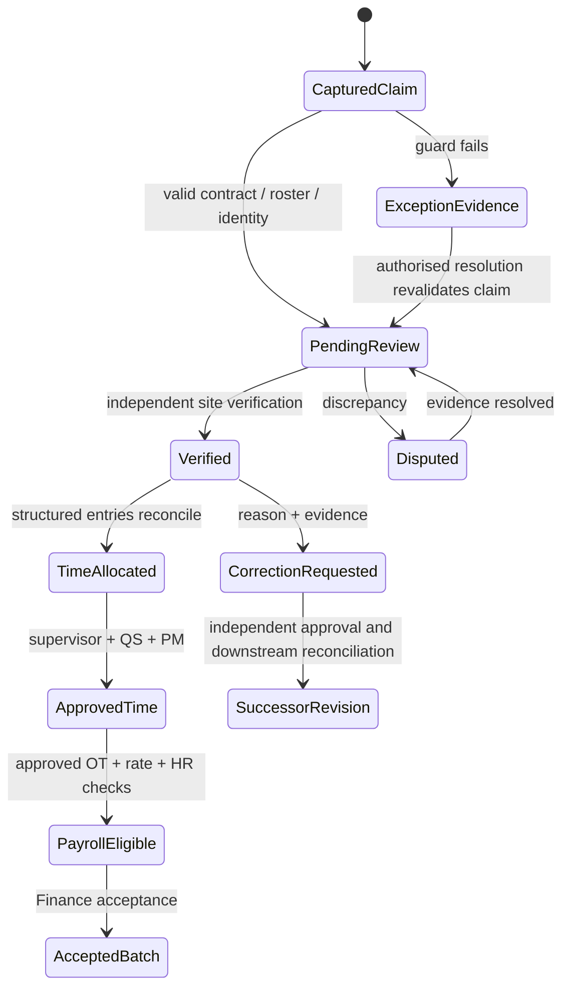

# Permissions, workflow states and integration events

These are proposed implementation contracts. No permissions or workflow definitions are installed by Phase 1.

## 1. Permission model

Authorisation is **capability AND organisation AND project/site/worker scope AND state guard AND segregation-of-duties guard**. A role name is only a configurable bundle of capabilities. The browser uses the same capability catalogue for navigation, but the server enforces every action independently.

Reuse `core.permissions`, `core.roles`, `core.role_permissions` and `core.user_roles`. Broad existing `workforce.read/create/update/delete` permissions are compatibility inputs, not sufficient final approval permissions. New roles do not automatically receive the union of historic broad grants.

| Proposed permission family | Actions / scope |
|---|---|
| `workforce.people` | `read`, `create`, `update`, `archive`; operational projection only, tenant or own-worker scope |
| `workforce.organisation` | `read`, `manage`; catalogues/reporting relationships, not user-role administration |
| `workforce.availability` | `read`, `manage`; cannot override HR/HSE-owned restrictions |
| `workforce.plan` | `read`, `create`, `submit`, `approve`; assigned project/site scope |
| `workforce.requisition` | `read`, `create`, `submit`, `recommend`, `approve`; scoped supply request |
| `workforce.mobilisation` | `read`, `prepare`, `verify`, `approve`; verification item ownership separately checked |
| `workforce.deployment` | `read`, `propose`, `approve`, `activate`, `suspend`, `end`; no generic update of active authority |
| `workforce.attendance` | `read`, `capture`, `verify`, `dispute`, `correct`, `correction_approve`; own/crew/site variants |
| `workforce.timesheet` | `read`, `create`, `submit`, `supervisor_review`, `project_approve`, `correct`; no generic approval alias |
| `workforce.overtime` | `read`, `request`, `recommend`, `approve`, `verify_actual`; dated request scope |
| `workforce.crew` | `read`, `manage`, `reassign`; worker scope derives from crew/deployment |
| `workforce.productivity` | `read`, `record`, `accept`, `explain`; output acceptance owned by Site Operations |
| `workforce.skills` / `workforce.training` | `read`, `manage`, `verify`; source-owner restrictions; no self-verification |
| `workforce.transfer` / `workforce.demobilisation` | `read`, `request`, `recommend`, `approve`, `close`; sending and receiving site scopes |
| `workforce.payroll_input` | `read`, `generate`, `project_verify`, `workforce_validate`, `submit`; no Finance posting permission implied |
| `workforce.exception` | `read`, `assign`, `resolve`; severe closures need independent verification |
| `workforce.report` | `read`, `export`; intersect row scope, field classification and report-specific cost/pay capabilities |
| `workforce.audit.read` | Redacted business history; no update/delete capability |
| `workforce.settings.manage` | Versioned operational policies; business approval needed before policy activation |
| HR-sensitive capabilities | `hr.identity.read`, `hr.discipline.read`, `hr.engagement.verify`, `hr.payroll_input.validate` (proposed); reuse existing leave permissions |
| Finance-sensitive capabilities | Existing `finance.payroll.read/manage/post`; proposed `finance.bank_details.read`, `finance.labour_cost.read`, `finance.rate.propose/approve`, `finance.workforce_budget.check`, `finance.payroll_input.accept/return` |
| HSE capabilities | Reuse/extend compliance/HSE verification and override permissions; medical detail access separate from fit-for-work status |

Exact catalogue migration must reconcile existing keys, not blindly create aliases. API compatibility work must remove accidental double requirements from generic POST=create middleware without removing endpoint authentication or action guards.

## 2. Default role-to-responsibility matrix

The following is a proposed baseline for all requested roles. `View` always means assigned scope; sensitive fields require additional grants. Approval actors are actual users, not just different role labels.

| Role | Read scope | Capture / prepare | Verify / approve | Sensitive and administrative limits |
|---|---|---|---|---|
| System Administrator | Platform operational diagnostics; explicit tenant support scope | Platform configuration | No routine business approval by default | Break-glass audited and time-limited; cannot self-approve by SUPERADMIN bypass |
| Organisation Administrator | Organisation operational views | Role/catalogue administration | Policy activation only with business owner authorisation | No automatic salary, bank or discipline access |
| Managing Director | Portfolio summary, exceptions, permitted costs | Delegated business decisions | High-threshold escalation/final policy approval | No silent bypass of mobilisation or SoD |
| Director | Assigned portfolio | Escalations | Delegated threshold approvals | Costs by grant; individual salary restricted |
| Operations Manager | Organisation/site operations | Cross-project plans and movements | Operational plan/movement escalation | Not Finance pay posting |
| Project Manager | Assigned projects | Plans, requisitions, deployment proposals | Deployment, OT and project timesheet approval | Budget/cost view, limited compensation only if explicitly granted |
| Workforce Manager | Workforce operational population | Registry operations, availability, plans, mobilisation | Workforce validation, movement approvals as delegated | Cannot approve own worker/rate/time/pay cycle |
| HR Officer | Personnel and authorised sensitive HR | Engagement, profiles, skills/training | HR compliance and payroll-input validation | Leave remains HR; banking/salary only additional grants |
| Quantity Surveyor | Assigned portfolio/project cost evidence | Budget checks and cost-code mapping | Cost checks; no final OT/time entitlement approval | Internal labour cost, not private banking or net pay |
| Site Quantity Surveyor | Assigned site cost evidence | Site cost review | Delegated site budget/cost check | Same separation as QS, narrower scope |
| Site Agent | Assigned sites | Site plans, requisitions and movements | Attendance verification, site recommendation, actual OT verification | Cannot approve own evidence; no salary/bank access |
| Site Engineer | Assigned sites/activities | Activity/output and workforce requirements | Output acceptance, delegated engineering review | Not independent verifier if also recorder where SoD requires separation |
| Foreman | Assigned crews/shift | Attendance, time drafts, OT requests, output claims | Limited crew recommendation; optional delegated review of others | Cannot verify own time or finally approve own capture |
| Site Clerk | Assigned site | Register capture, document capture, draft time | No final verification by default | No rate/contract approval or payroll generation |
| HSE Officer | Assigned compliance readiness | Induction/fitness/PPE evidence | HSE items and restrictions, controlled waivers if delegated | Medical detail only under HSE clinical grant; no time/pay approval |
| Finance Officer | Approved time/input and authorised financial fields | Rate preparation or Finance processing, separated by user | Rate verification, input acceptance/return, Finance processing | Cannot combine prohibited steps merely by holding multiple roles |
| Risk/Internal Control Officer | Scoped audit, exceptions, approved cost evidence | Findings/corrective action | Independent severe-exception closure/override audit | No normal record rewriting; sensitive access separately granted |
| Employee/Worker | Own profile, roster, time and approvals | Own clock/PIN/QR claim, timesheet, dispute | None for own records | Cannot list peers or choose another employee ID |
| Subcontractor Supervisor | Own employer's deployed workers within contracted sites | Crew claims and registers | Recommendation only; SNC verifies | Cannot access competitors or SNC employee private data |
| Read-Only Auditor | Explicit audit engagement scope | None | None | Export separately granted; no mutation endpoints |

### Segregation of duties

- The subject worker, originator and final approver must not be the same person for time, correction, rate or payroll input. A delegated actor remains subject to the same rules.
- Rate proposer and rate approver are distinct. Payroll generator/submitter and Finance acceptor/processor are distinct. Workforce/HR/QS/PM stages designated independent cannot be satisfied by one person switching roles.
- For small sites, route to a remote authorised reviewer; do not relax the rule silently. Owner-approved delegation records specify scope, effective dates and reason. A delegation cannot elevate the delegator's authority.
- Detect conflicting role grants at administration time and show a conflict report. Runtime action checks remain mandatory because legitimate multi-role users can still be involved in a prohibited transaction.
- SUPERADMIN can repair configuration but cannot force a business state through normal APIs. Emergency support uses a separate scoped audit procedure and cannot manufacture verification evidence.
- Changing a role or policy does not rewrite prior approval history. Store the effective capability/policy/delegation version with each decision.

## 3. Workflow matrix

| Workflow | Initiator → stages | Mandatory guard before terminal transition | Rejection / correction | Events / phase |
|---|---|---|---|---|
| Plan / requisition | PM/Engineer/Foreman → site recommendation → QS budget/programme check → PM/delegated approval → Workforce fulfilment | Valid programme/activity/skill/date/cost code; internal supply match captured; no approval of changed version | Reason required; revised submission, previous decisions retained | `workforce.requisition_*`; Phase 3 |
| Mobilisation / deployment | Workforce prepares → HR identity/contract → HSE readiness → competency verification → supervisor/site/rate/cost assignment → PM approval | All blocking requirements pass for effective dates; no conflicting interval; project itself authorised | Failed checks leave worker undeployed; conditional waiver only authorised non-blocking policy exception | `worker.mobilisation_completed`, `worker.deployment_*`; Phase 4 |
| Attendance | Scheduled → worker/Foreman/Clerk captures → worked interval → exit → independent site verification | Valid contract/deployment/shift; leave/restrictions checked; complete or independently resolved clock evidence; reconciliation | Dispute/correction command with reason, evidence and successor version | `attendance.*`; Phase 5 |
| Timesheet | Worker/Foreman draft → supervisor review → QS cost check → PM approval | Exact verified attendance revision; activity/cost code open; minutes available; rate and OT eligibility resolved | Return/reject with reason; revision resubmitted; original remains locked | `timesheet.submitted/approved`; Phase 6 |
| Overtime | Supervisor request → Site Agent recommendation → QS budget check → PM approval → work → site verifies actual | Named eligible workers, dated authorised window/minutes/output; actual evidence preserved separately | Denied request retained; worked unauthorised OT becomes exception, not deleted time | `overtime.requested/approved/rejected`; Phase 6 |
| Production | Crew target → actual hours/output → Engineer accepted/rejected output → variance/cause → corrective action → independent closure | Comparable quantity unit/baseline; labour source deduplicated; acceptance evidence | Rework/rejection retained; revised acceptance cannot silently change locked cost/period | `productivity.threshold_breached`, corrective event; Phase 7 |
| Transfer | Sending site request → receiving site acceptance → Workforce/PM approval → dated atomic move | Destination mobilisation passed; no overlap; source time and assets reconciled or exception escalated | Cancel before effective transition; after movement use new movement/reversal, not edit | `worker.transfer_approved`; Phase 8 |
| Demobilisation | Deployment ending → final time → tools/PPE/accommodation/advances check → assessment → clearance → close | Revoked access, accountable clearances, final evidence retained and notified to HR/Finance | Outstanding items block closure or follow explicitly approved exception; worker cannot remain silently active | `worker.demobilised`; Phase 8 |
| Payroll input | Generate from evidence → project verification → Workforce validation → HR validation → Finance submit → accept/return | Verified attendance + approved entries + OT authorisation + approved rate; no duplicate entitlement, source hash unchanged | Return reason; replacement version/adjustment; accepted input never edited | `payroll_input.*`; Phase 9 |

## 4. State machines

These are business states, not UI labels. Only named commands may change them; direct generic status updates are prohibited.

| Aggregate | Allowed main path | Alternative transitions and immutable boundary |
|---|---|---|
| Worker | `registered → verified → eligible` | HR lifecycle `suspended`, `terminated`, `archived` independent of deployment; re-engagement adds engagement, not deletes history |
| Engagement | `draft → submitted → verified → active → expired/ended` | `submitted → rejected`; supersession by new version; effective date controls active state |
| Plan | `draft → submitted → cost_checked → approved → superseded/closed` | Return/reject/cancel by authorised role; changes to approved plan create revision |
| Requisition | `draft → submitted → recommended → budget_checked → approved → partially_fulfilled → fulfilled` | `submitted/recommended/budget_checked → returned/rejected`; cancel only unfulfilled portion |
| Mobilisation | `draft → checking → ready → approved` | `checking → blocked`; `ready → checking` on evidence change; approved snapshot immutable; expiry blocks deployment eligibility |
| Deployment | `proposed → mobilisation_pending → approval_pending → scheduled → active → demobilising → ended` | `active/scheduled → suspended`; resume requires fresh eligibility; pre-start cancel; transfer produces linked end/new start |
| Shift attendance | `scheduled → captured → submitted → verified` | `captured/submitted → exception_pending/disputed`; resolution returns to review; verified record locked |
| Attendance correction | `draft → submitted → approved/rejected` | Approved creates successor and downstream reconciliation atomically; never mutates original attendance values |
| Timesheet | `draft → submitted → supervisor_reviewed → cost_checked → approved` | Review stages → `returned/rejected`; resubmission creates version; approved locked |
| Overtime request | `draft → requested → recommended → budget_checked → approved → actual_verified → closed` | Review stage → rejected/returned; cancellation only future unused authority, never erases actual hours |
| Productivity | `draft → submitted → output_accepted → assessed → closed` | `submitted → output_rejected`; partial accepted/rejected quantities coexist; below threshold → explanation/action required |
| Training | `planned → enrolled → completed → assessed → verified` | failed/withdrawn; credential expiry derived separately, not an edit to completion evidence |
| Transfer | `draft → submitted → sending_recommended → receiving_accepted → approved → effective → closed` | reject/cancel before effective; effective movement cannot be edited back |
| Demobilisation | `requested → clearance_pending → approved → access_revoked → closed` | returned for missing clearance; access may be suspended immediately while clearance remains pending |
| Payroll input | `draft → generated → project_verified → workforce_validated → hr_validated → submitted → accepted` | any validation stage → returned; returned submission creates revised batch; accepted immutable, adjustment only |
| Exception | `open → assigned → investigating → resolved → closed` | severity escalated; independent closure for high/critical; recurrence opens linked new exception |

Each transition locks target and approval instance, checks expected version, records a business decision and audit action, writes the event, and commits once. A retry of the same command returns the committed result; a reused key with different content returns conflict.

## 5. Event envelope and delivery contract

Reuse `app/shared/events.emit_event` and `core.domain_events`. Canonical event names use the existing `.v1` convention; the user's base name is retained before the suffix.

Envelope: event UUID, organisation, event type/schema version, aggregate type/ID/version, project/site scope, actor, occurred-at, correlation/causation IDs, command ID and minimal data/evidence references. Do not include identity numbers, medical details, bank data or salary in broad events.

Idempotency key: `event_type:aggregate_id:aggregate_version:transition`, within the organisation. The current default event-type/aggregate key needs a revision suffix for repeated state changes. Event insertion is atomic with the business transition.

Outbox dispatcher leases committed events (`FOR UPDATE SKIP LOCKED` or equivalent), publishes event IDs to the existing Redis/Arq transport, and retries with bounded backoff. A crash after publish but before acknowledgement may redeliver. Each consumer writes `(organisation, event_id, consumer_name)` receipt in the same transaction as its effects. Use per-consumer delivery state; one global `processed` status cannot prove every subscriber completed.

Dead letters retain event and error classification; operator replay is authorised and audited. Consumer payload/schema compatibility is versioned. Delayed or out-of-order events use aggregate version to avoid reinstating stale site access or availability. External email/push runs after commit through delivery jobs, not inside the business transaction.

## 6. Event catalogue

Every event below is required target behaviour; current Workforce routes do not yet emit this complete catalogue. Existing `compliance.deployment_blocked.v1`, `compliance.deployment_cleared.v1` and `site.daily_report.*.v1` should be integrated, not duplicated.

| Event (append `.v1`) | Producer / commit trigger | Consumers and idempotent effect |
|---|---|---|
| `workforce.requisition_submitted` | Workforce / submitted revision | Core approval instance + scoped approver notification |
| `workforce.requisition_approved` | Workforce / final authority | Workforce sourcing, Projects resource forecast; one fulfilment task per revision |
| `workforce.requisition_rejected` | Workforce / rejection with reason | Requester notification; close pending sourcing activity |
| `worker.mobilisation_completed` | Workforce / all required checks verified | Deployment readiness projection; no site access grant yet |
| `worker.deployment_approved` | Workforce / approval snapshot | Projects resource plan; schedule future eligibility, not early physical access |
| `worker.deployment_started` | Workforce / effective start and fresh guards | Site access activation, roster availability update |
| `worker.deployment_suspended` | Workforce / restriction or authorised suspension | Site access revoke/suspend, crew replacement, Risk exception |
| `worker.deployment_ended` | Workforce / effective end | Site access revoke; remove future roster eligibility |
| `attendance.captured` | Workforce / raw or manual capture persisted | Site pending register; exception evaluator; never payroll |
| `attendance.verified` | Workforce / independent verification | Timesheet eligible-minute projection, daily labour return |
| `attendance.corrected` | Workforce / successor approved | Invalidate stale draft time; trigger controlled approved-time/payroll reconciliation |
| `attendance.exception_created` | Workforce / deduplicated rule breach | Site queue, Risk and accountable supervisor notification |
| `overtime.requested` | Workforce / request submission | Budget/recommendation workflow |
| `overtime.approved` | Workforce / PM authority after cost check | Authorised OT projection for named workers/time window |
| `overtime.rejected` | Workforce / rejection | Requester notice; preserve worked claims |
| `timesheet.submitted` | Workforce / revision submitted | Supervisor → QS → PM review queue |
| `timesheet.approved` | Workforce / final operational approval | Labour-cost evidence and payroll candidate projection; does not itself post payroll |
| `productivity.threshold_breached` | Workforce analytics / assessed accepted output | Cause/explanation task and exception, unique per assessment revision |
| `workforce.corrective_action_created` | Workforce / linked action created | Existing corrective-action/task engine, responsible owner |
| `certification.expiring` | Credential owner / scheduled threshold | HR/HSE renewal queue, affected future deployment recheck |
| `contract.expiring` | HR / effective engagement threshold | HR renewal, supervisor and future supply forecast |
| `worker.transfer_approved` | Workforce / atomic movement authority | Both projects' rosters and access schedules; effect at effective timestamp |
| `worker.demobilised` | Workforce / approved closure | HR availability/exit update request, Finance final input notice, access revocation confirmation |
| `payroll_input.generated` | Workforce / immutable candidate snapshot | Validation queue; no payment |
| `payroll_input.submitted` | Workforce / all required validations | Chosen Finance intake adapter creates one receipt |
| `payroll_input.accepted` | Finance / input receipt accepted | Workforce locks accepted status and displays Finance reference |
| `payroll_input.returned` | Finance / returned with reason | Workforce correction queue, retaining original submission |
| `labour_budget.threshold_breached` | QS/cost projection / approved comparable calculation | PM/QS/Risk alert and action keyed by budget/period/version |

Additional inbound contracts needed from source owners: `hr.leave_approved/cancelled`, `hr.engagement_changed`, `hse.worker_restricted/cleared`, `credential.verified/revoked`, `project.activity_closed`, `finance.rate_approved`, `site.output_accepted/corrected`. Final names must align with existing source-owner events during each integration phase. Payloads include effective dates and source versions; daily rechecks provide recovery, not a substitute for transition events.

## 7. Audit and policy controls

Every approval, rejection, override, correction, role/policy change, transfer, demobilisation and payroll submission must identify actor, organisation, target/version, reason, delegated authority, previous/new state, evidence and correlation ID. Audit read access is tenant-scoped and sensitive diffs are redacted unless explicitly authorised. No ordinary application endpoint grants audit mutation.

Extend canonical audit infrastructure with business action metadata rather than using general logs as the approval record. DB triggers remain a backstop for row mutation; immutable decision rows and revisions provide business meaning. A trigger recording `UPDATE` alone does not prove who approved which evidence and why.

Settings are versioned and effective-dated: time rules, rounding, site holidays/timezones, competency requirements, mobilisation rules, OT thresholds, approval routing, productivity thresholds, exception severity/SLAs and report retention. Approval snapshots bind policy versions. A settings change cannot retroactively alter an accepted payroll input.
