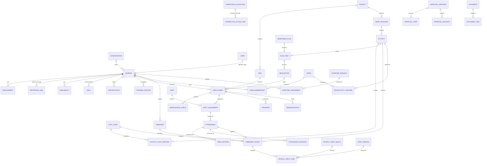

# Workforce data model and database contract

All definitions below are **proposed**, except rows explicitly marked existing. Phase 1 does not create tables. Physical names must be checked against the target database catalogue before migration authoring; repository migrations alone are not a schema snapshot.

## 1. Logical entity relationships

Every business aggregate and child includes `organization_id`, even where omitted from the diagram. Org-bound composite foreign keys connect parent and child. Generic approval/document/exception targets require an allowlisted target registry and server validation, because an arbitrary UUID reference cannot be protected by a normal FK.

## 2. Shared storage rules

- Primary keys are UUIDs. Mutable operational records use `created_by`, `created_at`, `updated_by`, `updated_at`, `version`, `is_deleted`, `archived_at` and archival reason as applicable. Historical child records remain reachable after archival.
- Add unique `(organization_id, id)` keys on referenced parents and composite FKs `(organization_id, foreign_id)`. Project/site links also prove site belongs to project, not merely that each UUID exists in the tenant.
- Keep browser `anon`/`authenticated` direct table access revoked unless a separately reviewed read-only need exists. Use a non-owner/non-BYPASSRLS application role and `USING`/`WITH CHECK` tenant policies with transaction-local `app.organization_id` set from authenticated database identity. Missing tenant context must deny access. Do not rely on `FORCE RLS` to constrain a superuser/BYPASSRLS role.
- Shared reference tables can have a separate read policy; workers iterate organisations with explicit scoped transactions. Storage object authorisation checks the document's tenant, classification, viewer permission and linked entity on each signed download request.
- Actor and tenant context must be set at the beginning of **every** transaction. Current authentication sets actor context once; an internal commit clears transaction-local settings.
- Mutable aggregates use `version`/ETag compare-and-swap. Terminal approved/verified rows have DB update guards. Approved business values change only through an approved successor revision; an append-only supersession link determines the effective version.
- Store timestamps as UTC `timestamptz`, site timezone as an IANA identifier, and roster/work date explicitly in site time. Shift intervals use half-open `[start, end)` semantics. A shift crossing midnight retains one roster identity, with daily reconciliation split according to the approved policy.
- Store calculated duration as integer minutes; convert to decimal hours at the API boundary for compatibility. Store money in `numeric(18,4)` calculation fields with ISO currency; round only at the Finance-approved boundary. Quantities use `numeric(18,6)` plus a unit. Never use binary floats for cost reconciliation.
- Records have source system, source ID/revision, captured time, received time, evidence references and command idempotency key where relevant. Do not accept client-supplied verification/approval actors or tenant IDs.
- Partial uniqueness excludes archived catalogue rows where safe. Operational history must not regain the same business identity merely because an old row was soft-deleted. Nullable dimensions need explicit uniqueness treatment; avoid relying on ordinary UNIQUE semantics for null site/project IDs.
- Restrict hard deletes of operational parents, audit records and approved evidence. Cascades on existing HR tables must be reviewed before archival rollout. Retention deletion is a separate privileged, logged policy process with legal-hold checks.

## 3. Entity specification and reuse map

**E** = existing structure to reuse; **X** = existing structure to extend; **N** = proposed new structure. Names are planning identifiers, not migration instructions.

| Entity / status | Storage / owner | Required fields and relationships | Essential constraint or index |
|---|---|---|---|
| Organisation / E | `core.organizations` / Core | Existing identity and organisation settings | Authoritative tenant; no caller override |
| User / E | `core.users`, role grants / Core | Existing active identity; optionally linked worker | DB organisation and active state checked; multi-role grants cannot bypass SoD |
| Worker profile / X | `hr.employees` / HR identity, Workforce operational projection | Number, name, photo document, category, department/position, base location, trade, operational contacts; optional linked user and subcontract employer | Org workforce number unique; worker number never reused; employee/user link same org |
| Restricted personal data / N or existing HR extension | HR-owned restricted projection/table | Encrypted identity number/contact detail; keyed duplicate fingerprint; emergency contacts; restricted document references | Unique normalised identity per tenant where reliable; no national ID in logs/events; bank duplicates create controlled review, not automatic rejection |
| Engagement / N linked to existing documents | `hr.worker_engagements` / HR | Worker, employer, engagement type, contract document/version, valid dates, normal minutes, jurisdiction, contract verification, status | Date consistency; no invented approval from `employees.end_date`; historical contract versions retained |
| Categories / N | `hr.worker_categories` / HR | Stable code, label, employee-payroll eligibility, active flag | Org/code unique; cover permanent, fixed-term, casual, general hand, intern/apprentice, operator, subcontractor, consultant, specialist; former worker is lifecycle status, not current engagement type |
| Department / X | Reuse/map `finance.departments` with shared directory / Core–HR–Finance | Existing accounting department ID, hierarchy and HR reporting meaning if same organisation unit | Do not create parallel code lists; separate mapped HR org unit only where organisational and accounting structures differ |
| Position / N | `hr.positions` / HR | Code, title, department, grade, trade/competence requirement references | Org/code unique; active, effective-dated catalogue |
| Team / X | `core.teams`, membership extension / Core | Existing user teams; worker membership relation where person has no login | Membership IDs tenant-safe; user and worker identities must not double-count one person |
| Supervisor assignment / X | `hr.reporting_lines` / HR + project authority | Worker, manager worker, relationship type, project/site, valid period, approved authority reference | No self-report; prevent cycles and overlapping primary managers for same scope; index worker/date |
| Availability / X | `hr.employee_availability` / Workforce | Worker, interval, capacity, reason, source leave/training/medical/engagement ID, source revision | Derived restrictions outrank manual available; approved leave cannot be overwritten by Workforce |
| Skills / X | `hr.employee_skills` / HR competency | Trade/skill catalogue ID, level, experience, assessor, assessed date, evidence, verification | Controlled level scale; unique worker/skill/version; assessments cannot self-verify |
| Qualifications / N or certification subtype | Extend `hr.employee_certifications` / HR | Kind, qualification name, issuer, number, awarded date, verification evidence | Qualification without expiry still needs verification; avoid duplicate credential store |
| Certification / X | `hr.employee_certifications` / HR/HSE | Requirement/credential type, issue/expiry, scope/equipment class, verification, evidence version | Expiry effective on configured local date; index org/expiry; rejected/superseded never considered valid |
| Medical, induction, PPE status / X | `hr.employee_medicals`, asset assignments, compliance requirements / HSE | Worker/site scope, result and validity, source evidence | Operational API returns fit/blocked/expiry, not clinical details; source owner controls approval |
| Training / X | `hr.training_requirements`, `hr.training_records` / HR training | Provider, programme, participants, cost/currency, schedule/completion, assessment, resulting credential, refresher | Completion does not imply competency until assessment verified |
| Project / site / E | `projects.projects`, `projects.sites` / Projects | Project/site identities, active/closed state, site timezone/access integration | Composite org/project/site validity; prohibit new charges to closed scope |
| Work package / N | `projects.work_packages` / Projects | Project/site, WBS code, title, valid period, status, approved baseline reference | Project/WBS code unique; source programme version |
| Activity / N | `projects.activities` / Projects | Work package, activity code, schedule, planned quantity/unit/hours, optional task and BOQ references | Same project/site; no substitution of arbitrary CRM task; closed activity blocks new time |
| Cost code / X | `finance.cost_codes`, allowed activity mappings / Finance–QS | Existing code/category; activity and budget-line authorisations, validity | Only labour codes permitted for labour entry; org and budget/project scope checked |
| Manpower plan / X | `hr.workforce_plans` becomes versioned header / Workforce | Project/site, period/week, programme/budget version, owner, status, approval | Preserve existing plan rows via explicit migration mapping; one approved version per business plan |
| Plan item / N | `hr.workforce_plan_items` / Workforce | Plan, activity/work package, trade/competence, headcount, hours, start/end, shift, supervisor, cost code | Nonnegative requirements; within header period; index project/trade/date |
| Requisition / N | `hr.workforce_requisitions` plus items / Workforce | Plan item, quantity, competencies, dates, shift, cost code/budget, reason, urgency, requester, internal-match result, approval | Must evaluate internal supply before external recruiting; procurement requisitions remain separate |
| Mobilisation checklist / N | `hr.mobilisation_checks` and check items / Workforce coordination | Worker/deployment, requirement-set version, required/conditional items, evidence, owner verifier, result, as-of timestamp | Unique check/item; mandatory failure cannot be averaged away in readiness score; immutable submitted snapshot |
| Deployment / X | `hr.project_allocations` / Workforce | Worker, engagement, project/site, role, supervisor, interval, shift policy, approved rate/cost code, requisition, checklist and approval links | Existing allocation percentages retained for planning; serialise worker schedule changes; exclude conflicting active/scheduled site intervals |
| Shift / N | `hr.shifts`, `hr.shift_assignments` / Workforce | Site, timezone, scheduled interval/breaks, worker/deployment and roster date | Non-overlapping worker shift assignment across sites; shift within deployment/engagement |
| Site-access status / N | `hr.worker_site_access` projection / Workforce–HSE | Worker/site/deployment, eligible/suspended/revoked, effective version, consumer acknowledgement | Derived from authoritative guards; no UI direct grant; consumer lag cannot imply active access |
| Crew / N using shared team identity | `hr.crews`, `hr.crew_memberships` / Workforce | Optional Core team ID, site, foreman, shift, work package, trade mix, activity targets; worker/deployment/date membership | Core user team is not sufficient for non-login workforce; no overlapping crew slots per shift |
| Attendance event / X | `hr.attendance_events` / Workforce evidence | Worker, site, deployment/shift, event type, device/PIN/QR/manual source, observed/received timestamp, location, capture command ID | Append-only; unique org/device/client event ID; spoofed location does not verify presence |
| Attendance aggregate / X | `hr.attendance_records` / Workforce | Worker/shift/site/date, event references, regular/OT/break minutes, absence reason, verification state, verifier | Replace day-only uniqueness only after migration reconciliation; unique org/worker/shift/revision; daily cross-site invariant |
| Attendance correction / N | `hr.attendance_corrections` + revision links / Workforce | Original ID/version, proposed values, reason, evidence, requester, decision, approved successor ID | No overwrite of verified attendance; invalidate/reconcile downstream time and payroll before successor takes effect |
| Overtime / N | `hr.overtime_requests`, worker assignment items / Workforce | Site/activity, requested window/minutes, expected output, reason, budget, requester, QS and PM approvals; actual verified minutes | Request != evidence; approvals bind period/worker and version; no automatic entitlement from capture |
| Timesheet header / X | `hr.timesheets` / Workforce | Worker, period, version, workflow, status, totals derived from entries | Legacy worker/project/date uniqueness mapped explicitly; no arbitrary aggregate total edits |
| Timesheet entry / N | `hr.timesheet_entries` / Workforce | Header, verified attendance revision, activity/work package/cost code/BOQ, site, minutes ordinary/worked OT/eligible OT, crew/output and rate version | Sum entries <= verified attendance buckets; lock common worker/day/attendance when allocating time; multiple projects cannot spend same minutes twice |
| Productivity / N integrated with site evidence | `hr.productivity_records` / Workforce analytics | Crew/activity/date, planned hours/quantity, used hours, accepted/rejected/reworked quantities, unit, acceptance evidence, delay cause, baseline/rate version | No duplicate output attribution; accepted quantity <= measured total; accepted output owner distinct from recorder where required |
| Transfer / N | `hr.workforce_transfers` / Workforce | Worker, source/destination deployment/site, effective time, receiving/sending approvals, travel constraints, reason | Atomic source end/destination reservation/access state; no gap/overlap invented by async handlers |
| Demobilisation / N | `hr.demobilisations`, clearance items / Workforce | Deployment, end, final time, tools/PPE, accommodation, advances evidence, assessment, access revoke, destination status | Cannot close with blocking unaccounted items; disputed hours retained; Finance/HR own their clearance decisions |
| Rate version / X or new Finance child | `finance.employee_pay_profiles` + approved effective versions / Finance | Rate kind, worker/category, currency, basis, normalisation policy, ordinary/OT cost rate, approval and effective dates | Separate internal labour cost from salary/net pay; non-overlapping approved versions; HR proposes, Finance verifies |
| Payroll period / X | Reuse Finance payroll period convention / Finance | Start/end, currency/jurisdiction policy, status, cutoff | Workforce references Finance period, not independent pay calendar |
| Payroll input batch / N | `hr.payroll_input_batches` / Workforce | Period, scope, revision, totals by currency, source hash, approval stages, submission/receipt | Unique org/period/scope/version; immutable after accepted; generation idempotency |
| Payroll input line / N | `hr.payroll_input_lines` / Workforce | Worker, exact approved time entry/revision, ordinary/eligible OT, rate snapshot, currency/project/cost allocation | Unique source entitlement inclusion across live batches; returned batches reserve/release by explicit rule; no double payroll after retry |
| Workforce exception / N | `hr.workforce_exceptions` / Workforce | Rule/version, severity, worker/site/source/time, evidence, owner, status, due date, resolution | Unique org/rule/source/version; recurrence tracked; no guessed ghost-worker allegation presented as proven fraud |
| Corrective action / X | `compliance.corrective_actions` + task links / Compliance/Risk | Existing source type/id, owner, due date, evidence and closure | Workforce exception references existing corrective action; resolution requires evidence |
| Approval instance / step / X | `core.approval_instances`, `core.approval_steps` / Core | Target version, workflow/policy version, ordered capabilities, scope, due date, actor decisions | Approved instance cannot approve a changed target; unique pending workflow/target/version; lock instance and target |
| Approval decision / N in existing Core approval subsystem | `core.approval_decisions` / Core | Instance/step, outcome, mandatory rejection/override reason, actor, delegation, target version, time | Append-only; unique command key; actor cannot occupy incompatible stages |
| Document reference / X | `core.documents`, `core.document_links` / Documents | Tenant, entity, document revision, classification, evidence role, expiry | Same-tenant document FK plus allowlisted generic entity; signed downloads scoped and short-lived |
| Notification / E–X | `core.notifications` / Core | Recipient, event ID, action URL, delivery state | Unique recipient/event/template; no sensitive payroll content in push/email |
| Audit event / X | Canonical `core.audit_log` and existing reader / Core | Explicit org/actor, business action, entity/version, before/after redacted change, reason, approval/command/correlation ID | Extend existing audit infrastructure rather than add Workforce audit silo; append-only role grants; separate privileged access to sensitive diffs |
| Command receipt / N shared infrastructure | `core.command_receipts` / Core | Org, actor, action, idempotency key, payload hash, entity/version, result | Unique org/actor/action/key; mismatched replay payload => conflict; atomic with mutation |
| Event delivery / N shared infrastructure | Existing `core.domain_events` + delivery/receipt children / Core | Event immutable payload/version; delivery lease, retries, consumer, result | Unique org/event/consumer; no global processed flag treated as all-consumers success |

## 4. Time, overlap and revision invariants

1. Identity and engagement dates are checked at deployment start, each attendance work date and payroll eligibility evaluation. A backdated contract approval does not silently validate previously blocked records; a controlled reconciliation command is required.
2. Worker-level locking serialises concurrent allocation/shift/transfer updates. PostgreSQL exclusion constraints enforce overlapping effective intervals where feasible; date-only percentage allocations cannot stand in for site-time exclusivity. Extension availability such as `btree_gist` must be validated before choosing the migration implementation.
3. Official attendance requires a valid site/deployment/shift and contract. Failed capture still produces a durable claim or exception under an idempotent command. No invalid claim enters verified totals.
4. Store breaks and times explicitly. `ordinary + worked_overtime + unpaid_break` must reconcile to the approved worked interval policy; negative duration, overlapping breaks, future clock-out and clock-out before clock-in are rejected/escalated. Missing exit cannot become a fabricated full day.
5. A worker's cross-project entry totals cannot exceed the supporting verified ordinary and OT buckets. Approval and entry insert compete for the same locked evidence aggregate; checking each entry independently is insufficient.
6. Correction submission names original version and downstream dependants. Before replacing evidence already in an accepted payroll batch, create an adjustment/reversal workflow with Finance; never reopen or recalculate an accepted batch in place.
7. Evidence and approval snapshots include policy version and source hash. Changing a certificate, rate, programme or budget after submission triggers revalidation; approval is not a permission to use any later version.

## 5. Calculation contract

| Measure | Definition / evidence / edge cases |
|---|---|
| Active workforce | Unique non-archived workers with an effective eligible engagement; separate employment category and unavailable status |
| Expected workforce | Unique approved roster assignments in selected site/shift period, after leave/restriction rules; distinguish planned demand from roster |
| Present / absent | Verified present and verified absent are separate from captured/unverified and no-capture; missing record is not automatic absence |
| Available qualified supply | Eligible engagement AND no conflicting roster/leave/restriction AND current required verified competence; calculate for requested dates, not current status alone |
| Labour utilisation | Approved productive activity minutes / available roster minutes, with explicit exclusions and recorded idle minutes; denominator zero => unavailable |
| Labour cost | Sum approved entry hours × effective internal ordinary/OT cost rates; preserve currency and rate revision; no cost when rate missing, raise exception |
| OT cost | Verified payroll-eligible or operational-authorised OT × approved policy rate, explicitly labelled; worked unapproved OT stays separately visible |
| Labour budget variance | `(actual committed/posted labour cost - comparable approved labour budget) / budget`; positive = unfavourable; budget zero => absolute variance plus missing/zero-baseline flag |
| Productivity | Accepted quantity / actual labour hours, by crew/activity/unit; zero hours => invalid/unavailable, not infinite productivity |
| Productivity variance | `(actual quantity/hour - planned quantity/hour) / planned quantity/hour`; negative = unfavourable; no baseline => unavailable |
| Cost per accepted unit | Comparable labour cost / accepted quantity; zero accepted quantity => unavailable plus incurred cost/idle exception |
| Forecast / health score | Phase 10 only after owner-approved weights, coverage and freshness thresholds; publish components/evidence, never a black-box score |

Example acceptance fixture: planned 100 m² / 80 hours = 1.25 m²/hour; accepted 70 m² / 96 hours ≈ 0.729167; productivity variance ≈ -41.6667%. At an internal rate of 10 currency units/hour, planned labour cost is 800 and actual is 960 (+160, +20%). Actual cost/accepted unit ≈ 13.714286. Do not describe the +20% cost variance as the productivity variance.

## 6. Migration and compatibility strategy

1. Before Phase 2, inventory deployed schema, roles, grants, RLS, triggers and migration ledger/checksums without reading unnecessary worker personal data. Reconcile it to the raw SQL manifest and timestamped mirrors.
2. Use additive expansion first: nullable new references, separate revision/evidence children, constrained new writes. Legacy rows are `legacy_unverified` or equivalent provenance until validated; do not backfill fabricated contracts, supervisors, rates or approvals.
3. Normalise categories/positions/departments using an owner-approved import mapping and a rejected-row report. Do not delete duplicates automatically.
4. Add indexes/constraints after duplicate/orphan checks and backfill reconciliation. Validate composite FKs before making required fields non-null. Plan locks and deployment sequencing on realistic data.
5. Preserve `/workforce/` and existing attendance/timesheet read compatibility while introducing explicit action contracts. Document versioned response changes; update all HR/site/Finance consumers before retiring fields.
6. Cut over costing and payroll once: source-type/version ledger references prevent both site reports and timesheets posting the same cost. Reconcile historical totals before enabling new consumers.
7. Rollback disables feature writes/consumers, retains evidence and uses reviewed forward repairs or projections. Never roll back by dropping new approved records or deleting accepted payroll provenance.
