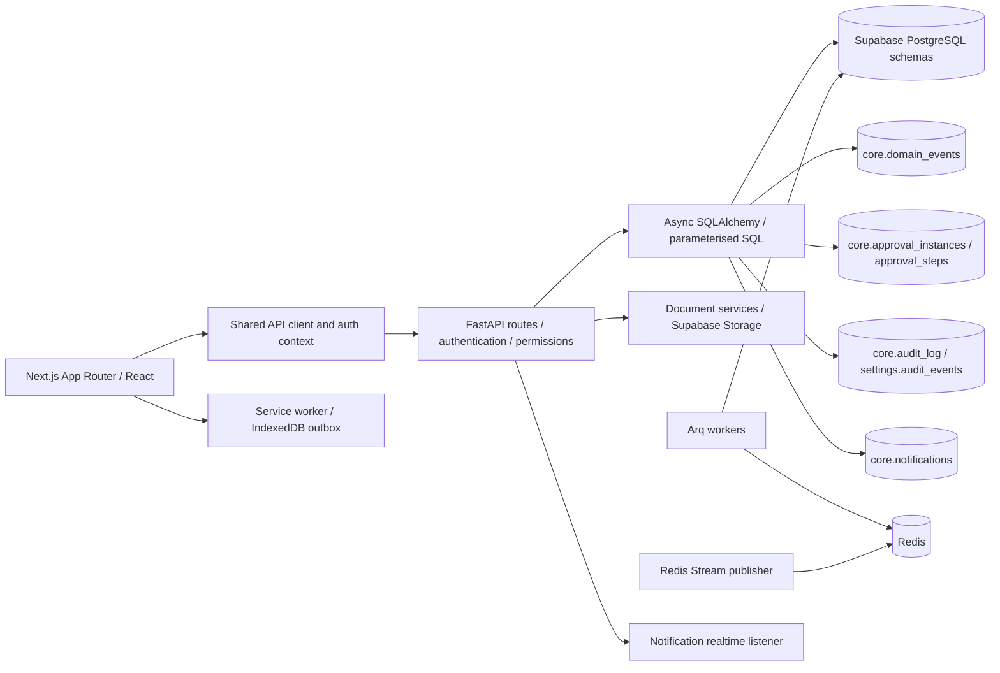

# AEGIS Workforce — Phase 1 architecture and specification

**Assessment date:** 5 September 2026, Africa/Harare.  
**Baseline commit:** `9a31613e7f94d6fa236786602fd26371d1408bfd`, plus the existing dirty working tree.  
**Authorisation:** architecture and specification only. No implementation, migration, role assignment, deployment or external notification is authorised by this phase.  
**Status:** specification prepared for owner review; implementation approval pending.

The target is a construction workforce-control system answering: **who is working where, doing what, under whose authority, at what cost, with what qualifications, and producing what result?**

This assessment distinguishes repository evidence from proposed design. A table or endpoint in source is not proof that it is deployed, correctly configured, or operationally accepted. The earlier local Workforce enhancement is part of the assessed baseline; it does not satisfy the new phase acceptance requirements by itself.

## Review pack

| Requested deliverable | Location |
|---|---|
| Current architecture, reusable components, boundaries and gaps | This document |
| Entity relationships, database specification and invariants | [Data model](./DATA_MODEL.md) |
| Permission matrix, segregation of duties, workflow matrix, state machines and events | [Controls and workflows](./CONTROLS.md) |
| Existing and proposed APIs, screens, dashboards and all reports | [Interface contracts](./INTERFACES.md), [observed API inventory](./API_OBSERVED.md) |
| File-level backlog, acceptance criteria, testing, attack cases and release report | [Delivery and verification](./DELIVERY.md) |
| Static migration preflight output | [Baseline evidence](./migration-preflight.txt) |

## 1. Current system architecture

The diagram deliberately does not assert a working domain-event-to-Redis dispatcher: a complete Workforce consumer pipeline was not found in the inspected code.

- **Frontend:** `aegis-web/package.json` declares Next.js `^16.3.3`, React `^19.2.8`, TypeScript, Tailwind, Lucide and Supabase JS. Existing `docs/ARCHITECTURE.md` still describes Next.js 14 and is not the version authority. Client pages use `src/lib/api.ts`, the shared auth context, dashboard shell and AEGIS tokens such as `ink`, `paper` and `signal`.
- **Backend:** `imperium-api/main.py` mounts modular FastAPI routers. Trusted-host, CORS, rate-limit and structured-logging middleware exist. Most mature domain routes use Pydantic request models and explicit SQLAlchemy `text` queries, not the generic ORM skeleton.
- **Identity:** `core/security.py` resolves the authenticated identity to `core.users`, reconciles organisation identity, checks DB role memberships and returns both `user_id` and compatibility `sub`. Permissions accumulate through role membership. A primary role is also resolved for navigation. SUPERADMIN bypass exists and needs explicit treatment in the Workforce approval design.
- **Persistence:** `core/database.py` provides pooled async sessions. Domain schemas include `core`, `hr`, `projects`, `finance`, `compliance`, `procurement` and `fleet`. SQL migrations frequently revoke direct browser access and grant service-role access. This is not equivalent to tenant-enforcing RLS on the backend connection.
- **Audit:** foundation triggers write `core.audit_log`; `get_current_user` sets transaction-local actor context. Settings has its own audit events and a combined audit reader. Trigger coverage on subsequently added tables and actor context after internal commits must be verified.
- **Approvals:** `core.approval_instances` and `core.approval_steps` are used by Site Operations. They are the reuse target. `app/services/workflow_service.py` and `app/models/workflow.py` contain a separate skeletal ORM approach: unscoped workflow lookup, internal commit and placeholder target foreign key. Do not adopt it unchanged.
- **Events/jobs:** `app/shared/events.py` inserts deduplicated domain events in the caller's transaction. `app/events/bus.py` publishes Redis Streams. Arq registers quotation, notification and CRM/CCB jobs. The Workforce alert script is not listed in the inspected Arq registry. The repository contains ingredients, not evidence of complete Workforce event consumption.
- **Offline:** `public/sw.js` queues broad same-origin API mutations and returns `202` with `success: true` and `queued: true`; it serialises request headers and deletes queued records after 4xx responses. This needs controlled reuse: drafts must remain distinguishable from persisted/approved records, credentials must not be retained as replay payload, and rejected evidence must remain recoverable.
- **Migrations:** the raw SQL ledger and Alembic bridge coexist with timestamped `supabase/migrations`. The ledger checks checksums and excludes explicit seed migrations by default. Future delivery needs one reviewed ordering/mirroring procedure; historical migrations must not be rewritten.

## 2. Ownership and reusable components

| Capability / authoritative owner | Observed source | Reuse decision and constraint |
|---|---|---|
| Organisation, users and role grants — Core | `core/security.py`; `routers/settings.py`; `core.roles`, `core.user_roles`, `core.permissions` | Reuse. Add action permissions and project/site/subcontractor scope; do not create Workforce accounts or an independent RBAC engine. |
| Worker identity and HR relationship — HR | `routers/workforce.py`; migrations 016, 140, 162; `hr.employees` | Preserve employee UUID as workforce identity, including non-login workers. Use HR-owned engagement history; avoid a duplicate person table. |
| Departments and teams — shared master data | migration 077 `finance.departments`; migration 105 `core.teams`, `core.team_members` | Link accounting departments instead of treating them automatically as HR departments. Extend shared team membership for workers; existing membership targets users only. |
| Reporting lines — HR | migration 162 `hr.reporting_lines`; `routers/hr_operations.py` | Extend effective dates, project/site context, uniqueness and cycle checks. |
| Contracts and documents — HR / Documents | `hr.employee_documents`, `core.documents`, `core.document_links`; migration 162 | Reference verified document revisions and authoritative engagement status. A document labelled current is not proof of an approved contract. |
| Leave decisions — HR | `routers/hr_records.py`; `hr.leave_requests` | Consume approved leave and cancellations; Workforce must not grant leave. Existing decision path sends a notification but does not update Workforce availability. |
| Competence / training — HR with HSE verification | migrations 016 and 162; `hr.employee_skills`, certifications, training records/requirements | Extend existing rows and evidence links. HSE owns fitness/induction decisions even where the physical table currently lives in `hr`. |
| Compliance gates — Compliance / HSE | `core/compliance.py`; migrations 025, 028, 029, 135 | Reuse checks, credential rules, controlled overrides and corrective actions. Extend to complete dated mobilisation, contract and site requirements. |
| Manpower plan — Workforce | migration 162 `hr.workforce_plans`; HR operations summary | Extend into versioned header/items and weekly linkage; do not create a competing plan repository. Current shortfall calculation is not a complete dated availability match. |
| Deployment — Workforce | migration 016 `hr.project_allocations`; `routers/workforce.py` | Evolve allocations to controlled deployment records with site, shift, supervisor, approval and readiness snapshots. |
| Attendance and time — Workforce | `hr.attendance_events`, `hr.attendance_records`, `hr.timesheets` | Reuse as event evidence, attendance aggregate and timesheet header respectively; add verification, entries and revisions. |
| Projects and sites — Projects | `projects.projects`, `projects.sites`, `projects.project_profiles`; `routers/projects.py` | Reuse project membership/readiness; distinguish project-level mobilisation from person-level mobilisation. |
| Work programme / activity context — Projects | project-linked `crm.tasks`, task engine, BOQ and weekly budgets | Use task references for workflow coordination. Define structured Project-owned work packages/activities; do not mistake a CRM task or free-text description for a costable activity. No dedicated work-package/activity table was found in the inspected migrations. |
| Budget and cost codes — Finance / QS | `finance.cost_codes`, `project_budgets`, `budget_lines`, `cost_transactions`; `projects.weekly_budgets`, `weekly_budget_items` | Reuse approved budget/version and cost-code IDs. Workforce produces cost evidence, never a second general ledger. |
| Production evidence — Site Operations | `projects.daily_site_reports`, `daily_report_labour`; `routers/site_reports.py` | Reference accepted output and labour lines. Reconcile costing ownership before enabling Workforce cost posting. |
| Pay profiles and payroll — Finance | migration 034; `routers/payroll_runs.py`; `routers/financial_performance.py` | Approved input batches feed Finance. Existing payroll can receive supplied hours; it is not proof of Workforce reconciliation. Inspect both Finance payroll routes before choosing the canonical handoff. |
| Notifications and history — Core | `app/shared/events.py`, `routers/notifications.py`, `routers/settings.py` | Reuse notification storage and history presentation; stage external delivery after committed events. |
| Exceptions / corrective work — Compliance / Risk / task engine | `compliance.corrective_actions`; `app/shared/task_stacks.py` | Add Workforce exception evidence linked to existing corrective actions/tasks. Do not create another task engine. |
| UI / reports | `components/ui/OperationalTable.tsx`, `components/auth/RBACGuard.tsx`, `lib/api.ts`, document renderers | Reuse visual system, API envelope and PDF/Excel libraries; add scoped query/report services and permission-based navigation. |

All paths above are relative to the repository root, under `imperium-api` unless explicitly prefixed otherwise. [Observed API inventory](./API_OBSERVED.md) provides exact endpoint source references.

## 3. Gap analysis

Severity below means **risk if the present baseline were released as the complete requested system**, not a verified exploit in a deployed environment. Nothing below is declared fixed in Phase 1.

| ID / priority | Evidence and gap | Required disposition / phase |
|---|---|---|
| G01 / High | Migration 017 grants unrestricted service-role policy access; inspected `get_db` does not establish org-local RLS context. | Non-bypass runtime role, tenant context and composite tenant FKs; direct SQL allow/deny tests. Phase 2 release blocker. |
| G02 / High | Workforce list/detail use `SELECT e.*`; browser profile filtering does not enforce field confidentiality. | Explicit operational projections and separate identity/pay/banking/discipline permissions and endpoints; secured document downloads. Phase 2. |
| G03 / High | Workforce POSTs require central `workforce.create` in addition to route-level permissions; decisions also use `workforce.update`. Self-service `/me/attendance` inherits the router read gate. | Replace resource-wide method mapping for action routes with explicit action dependencies; retain authentication globally; test every endpoint. Phase 2 foundation, activated per feature. |
| G04 / High | Generic ORM workflow service lacks tenant lookup and has an internal commit; Site Operations already uses different shared approval tables. | Standardise on existing Core approval tables with transaction ownership and capability-based steps. Phase 2. |
| G05 / High | Allocation gate checks active employment and configured certifications, but not a complete mobilisation checklist. Capacity uses a read/sum/write without serialising competing allocations. | Full readiness guards plus dated exclusivity and concurrent deployment tests. Phase 4. |
| G06 / High | Attendance capture does not enforce dated leave, contract expiry, active deployment, verification or corrections. | Preserve raw capture, block invalid official attendance and escalate discrepancies; verification/revision state machine. Phase 5. |
| G07 / High | Timesheet project is optional; description is free text; no costable entry FK; current decision checks recorded attendance, not verified attendance/QS/PM chain. | Structured entries and verified-time reconciliation; independent stages and locked versions. Phase 6. |
| G08 / High | Current timesheet rejection has no reason field or per-stage decision history. | Mandatory reasons, immutable decisions, controlled resubmission revision. Phase 2 approval foundation / Phase 6 integration. |
| G09 / High | Actual OT hours exist without an overtime request and budget/PM authorisation relationship. | Preserve worked OT, separately calculate authorised/payroll-eligible OT. Phase 6. |
| G10 / High | Finance payroll accepts supplied hours; Site Operations can post labour cost from daily-report evidence. | Approved batch provenance and single cost-posting authority; block double payroll/cost inclusion. Phase 9, contract established in Phase 6. |
| G11 / High | Core DB event records, Redis publisher and Arq exist; complete Workforce dispatcher/consumer receipts not found. | Transactional outbox delivery, per-consumer receipts, retries and dead-letter/replay operations. Phase 2 shared foundation; consumers by phase. |
| G12 / High | Broad PWA queue can queue decisions, retain authentication headers and discard 4xx evidence. | Allowlist draft capture; re-authenticate on replay; retain conflicts; never queue approvals or payroll submission. Phase 5, before offline activation. |
| G13 / High | Trigger audit actor context is transaction-local; new-table trigger coverage and immutable business decisions are not proven. | Establish actor/org context in each transaction; verify grants/triggers; add append-only action history through Core audit infrastructure. Phase 2. |
| G14 / Medium | Free-text department/category/role and incomplete effective-dated relationships; training/docs/reporting/plans exist but read summaries alone do not prove managed workflows. | Controlled catalogues and validated lifecycle endpoints; map legacy data without inventing approvals. Phases 2–3, 8. |
| G15 / Medium | Workforce page supports a small subset of requested navigation; caps of 250 people/500 allocations; limited daily filters; hard-coded page roles. | Permission-based navigation, cursor pagination, full empty/error/denied/mobile states and scoped summaries. Progressive phases; Phase 10 portfolio completion. |
| G16 / Medium | No linked crew/output accepted-quantity productivity workflow found. | Crew assignments and accepted/rejected output evidence with comparable-unit calculations and delay causes. Phase 7. |
| G17 / High | No complete transfer/demobilisation or site-access revocation workflow found. | Atomic dated movement, clearance and access revocation; block stale access during downstream outages. Phase 8. |
| G18 / Medium | Multiple migration representations, skeleton ORM versus actual SQL and stale architecture notes. | Adopt raw SQL ledger conventions and reviewed Supabase mirror generation; schema-drift checks before upgrades. Phase 2 onward. |
| G19 / High | Prior tests are primarily source contracts and mocked behaviour; no production-schema/concurrency/browser acceptance proof. | Real PostgreSQL, HTTP authorisation and multi-actor browser fixtures; deny release on absent required evidence. Every implementation phase. |

The current static migration preflight reports no errors but three warnings. Its warning about a table named `was` appears to be a comment-parsing false positive in migration 067; the two SECURITY DEFINER grant warnings require targeted validation. A static scanner cannot establish deployed policy or trigger safety.

## 4. Architecture decisions proposed for approval

1. Retain the modular monolith and one canonical worker UUID. Keep new Workforce operational tables in `hr` for compatibility; API ownership does not require moving HR-owned records between schemas.
2. Use existing Core approval instances/steps, domain events, audit infrastructure, notifications, document links and role catalogues. Extend them where needed; do not instantiate the skeleton ORM approval system beside them.
3. Use a non-owner, non-BYPASSRLS runtime database role for Workforce data, explicit transaction-local tenant/actor context and composite tenant FKs. Keep migration privileges and worker administrative enumeration separate. A privileged service credential is not a tenant boundary. See [Supabase RLS guidance](https://supabase.com/docs/guides/database/postgres/row-level-security).
4. Keep employment status, operational availability, deployment status, attendance status and payroll eligibility separate. They answer different questions and must not overwrite each other.
5. Make command services own transactions. Mutations, approval decisions, revision links, audit entries and outbox events commit together. Persistence of a blocked gate must not accidentally commit unrelated mutations; refactor current nested gate commits behind an explicit transaction contract.
6. Store raw time claims independently from approved time. Official attendance after contract expiry is blocked, but claimed work evidence is retained as an exception. Approved leave produces a blocking/escalation path, never normal present attendance.
7. A deployment is not site access until the dated readiness and authority checks pass. Access revocation is immediate in the authoritative eligibility check even when a physical access consumer is delayed.
8. Model regular, worked overtime, authorised overtime and payroll-eligible time separately. HR/Finance-approved policy versions determine limits and pay rules; the software must not invent legal entitlement rules.
9. Store time as integer minutes, rates/costs as decimals with currency and dated rate versions. Use explicit quantity units, accepted output revisions and budget versions. Never sum mixed currencies or incomparable quantities.
10. Build safe mobile drafts on the existing PWA shell, with a Workforce-specific capture contract and conflict queue. No offline approval, payroll finalisation or rate approval.

## 5. Phase 1 scope, stories and acceptance

Scope: inspect source, map reusable entities and integrations, define end-state design and phase sequence, record risks, prepare acceptance/test contracts and owner decisions. Implementation work, environment changes and business transactions are outside this phase.

Stories: the owner can approve a bounded delivery plan; developers can locate authoritative existing data and exact extension points; reviewers can trace each mandatory control to a test and phase; module owners can see who publishes and consumes each event; operators can distinguish verified records from pending/offline claims.

Phase 1 is ready for review when all fourteen requested first-action deliverables are present, all twenty-five mandatory controls map to acceptance evidence, observed and proposed APIs are distinguished, duplicate-system risks are resolved in the design, and each unresolved business choice has an owner and a latest-needed phase. Review evidence and commands are in [Delivery](./DELIVERY.md).

## 6. Decisions requiring an owner

These are policy choices, not requests for routine engineering permission. Proposed defaults allow review without requiring all later-phase answers today.

| ID | Owner decision | Proposed default / latest needed |
|---|---|---|
| O1 | Which named people may approve each stage and delegate authority? What budget/OT thresholds require Director escalation? | Capability matrix in Controls; independent persons for HR, cost and final approvals; no self-approval even with multiple roles. Confirm named mappings before Phase 2 role rollout; financial thresholds before Phases 3/6. |
| O2 | Approved working-time policy by jurisdiction/project: shift calendars, breaks, rounding, overtime rules, holidays, maximum hours and currencies? | Minute-accurate evidence, no rounding or automatic OT entitlement, site-local timezone; Finance owns pay policy. Confirm before Phase 5/6. Do not infer Mozambique policy from Zimbabwe sites. |
| O3 | What constitutes an authoritative engagement and worker identity for casual/subcontract personnel? Which historic data source is approved for import? | One worker UUID, category plus dated HR engagement, subcontract employer link; no account required; ambiguous imports held for review. Confirm before Phase 2 acceptance. |
| O4 | May a person serve multiple projects in non-overlapping shifts, and who approves a same-day transfer? | Permit only non-overlapping approved shift/deployment intervals; block simultaneous sites; travel buffer configurable. Confirm before Phase 4. |
| O5 | Who accepts production quantities, and who owns operational cost posting when both site reports and timesheets describe the same labour? | Site Engineer accepts output, QS verifies costing; timesheet entries become canonical labour-cost sources, site reports reference them after controlled cutover. Confirm before Phase 6/7. |
| O6 | Which HSE requirements are never waivable, who can grant a time-limited exception, and how is physical site access connected? | No override of contract expiry, identity failure or failed medical; HSE owns remaining controlled waivers; logical access fails closed. Confirm before Phase 4. |
| O7 | Retention periods, shared-device policy, GPS/biometric consent and sensitive-record access? | Minimum offline personal data, no banking/identity images offline, devices re-authenticate, no biometrics in initial delivery. Confirm retention and access policy before Phase 2; device rules before Phase 5. |
| O8 | Which Finance payroll intake is authoritative, and are subcontract workers excluded from employee payroll? | Workforce submits versioned time/cost evidence to the chosen Finance endpoint; subcontract personnel feed subcontract valuation instead of employee pay unless HR/Finance explicitly classify otherwise. Confirm before Phase 9. |
| O9 | Initial rollout scope, expected workforce volume and offline duration? | Pilot one organisation and selected sites; performance acceptance fixture proposed in Delivery. Confirm before implementation release planning. |

**Delivery authorisation update (5 September 2026):** the owner subsequently instructed completion of Phase 1 corrections followed by Phases 2–11 in sequence. This supersedes the original request for separate phase permissions. Phase 2 implementation is underway; proposed business-policy defaults remain explicit configuration choices, and production role assignments, personnel imports and retention policies are not silently invented. Technical acceptance still requires evidence and no unresolved Critical/High issues.
